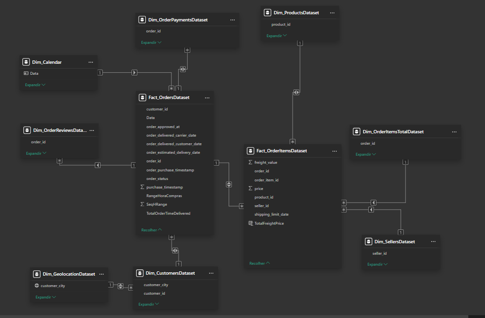
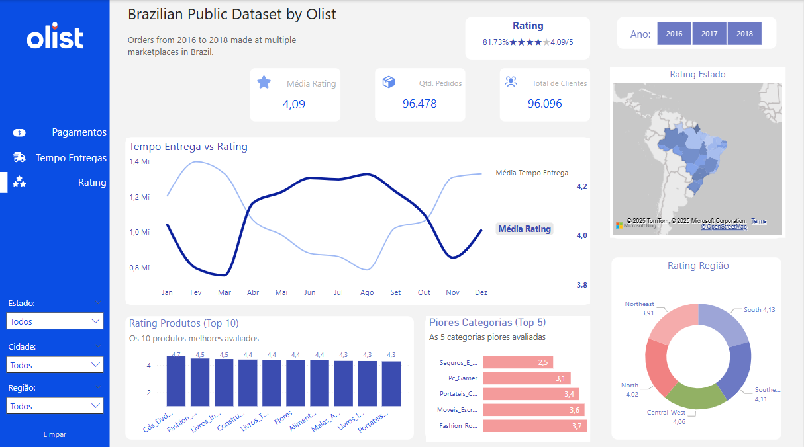
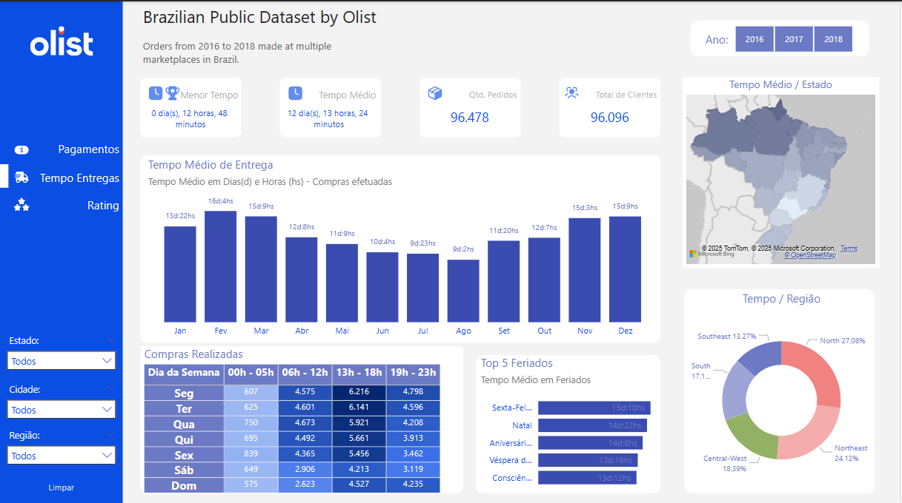
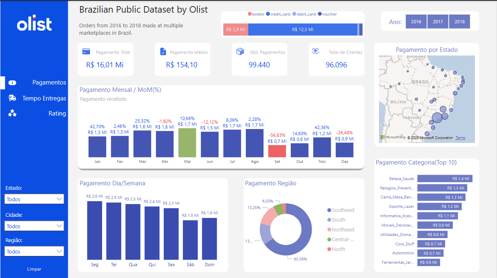

# Olist Store Dataset (2016 - 2018)
 Conjunto de Dados Público de E-Commerce Brasileiro da Olist

## Introdução 📓

Bem-vindo! Este é um conjunto de dados público de e-commerce brasileiro com pedidos realizados na Olist Store. O conjunto de dados contém informações sobre 100 mil pedidos feitos entre 2016 e 2018 em diversos marketplaces no Brasil. Suas características permitem visualizar um pedido sob várias dimensões: desde o status do pedido, preço, pagamento e desempenho do frete até a localização do cliente, atributos dos produtos e, por fim, avaliações escritas pelos clientes. Também disponibilizamos um conjunto de dados de geolocalização que relaciona os CEPs brasileiros com coordenadas de latitude/longitude.

Esses são dados comerciais reais, que foram anonimizados, e as referências às empresas e parceiros nos textos das avaliações foram substituídas pelos nomes das grandes casas de Game of Thrones.

## Contexto 📨
Este conjunto de dados foi generosamente fornecido pela Olist, a maior loja de departamentos nos marketplaces brasileiros. A Olist conecta pequenos negócios de todo o Brasil a canais sem complicações e com um único contrato. Esses comerciantes podem vender seus produtos através da Olist Store e enviá-los diretamente aos clientes utilizando os parceiros logísticos da Olist. Saiba mais no nosso site: www.olist.com

Após um cliente comprar um produto na Olist Store, o vendedor é notificado para atender ao pedido. Assim que o cliente recebe o produto, ou quando a data estimada de entrega expira, ele recebe por e-mail uma pesquisa de satisfação onde pode dar uma nota para a experiência de compra e escrever alguns comentários.

## Início da Análise 📊

O primeiro passo será analisar o arquivo que está no formato .CSV (separado por vírgulas) que nos foi enviado.
Abriremos o arquivo no *Google Sheets* para padronizar o nome das colunas, removendo espaços, caracteres especiais e erros.

Todos os dados encontram-se em: https://www.kaggle.com/datasets/olistbr/brazilian-ecommerce/data

**Metadados**

As informações de metadados encontram-se neste [LINK](/Metadados.txt)

## Data Schema

Abaixo o modelo Schema dos dados levantados:

## Relacionamento entre tabelas no Power BI 

## Resumo Executivo

Este relatório apresenta uma análise detalhada de três dashboards desenvolvidos a partir do conjunto de dados público da Olist, que contém informações sobre 100 mil pedidos realizados em marketplaces brasileiros entre 2016 e 2018. Os dashboards oferecem visões específicas sobre avaliações de clientes, tempos de entrega e comportamento de pagamentos, fornecendo insights valiosos para a tomada de decisões estratégicas.

## Dashboard de Avaliações (Rating)

### O que foi feito

- Consolidação da performance de avaliações dos clientes com média geral de 4,09/5 (81,73%)
- Criação de um gráfico correlacionando tempo de entrega e avaliações ao longo do ano
- Identificação e ranking dos 10 produtos melhor avaliados
- Destaque para as 5 categorias com piores avaliações
- Mapeamento geográfico das avaliações por estado e região do Brasil[^1]

### Insights Obtidos

- Existe clara correlação entre o tempo de entrega e a satisfação do cliente, com as avaliações flutuando inversamente ao tempo de entrega
- O gráfico "Tempo Entrega vs Rating" revela padrões sazonais, com quedas nas avaliações em determinados períodos do ano
- Categorias como "Seguros" (2,5) e "PC_Gamer" (3,1) apresentam as piores avaliações, sugerindo problemas específicos nestes segmentos
- As regiões Sul (4,11) e Sudeste (4,13) registram as melhores avaliações, enquanto o Nordeste (3,91) apresenta avaliações mais baixas[^1]
- A variação geográfica das avaliações pode estar relacionada a diferenças na logística de entrega entre as regiões

## Dashboard de Tempo de Entrega

### O que foi feito

- Apresentação dos tempos mínimo (0 dia, 12 horas, 48 minutos) e médio (12 dias, 13 horas, 24 minutos) de entrega
- Análise mensal do tempo médio de entrega em dias e horas
- Tabulação das compras realizadas por dia da semana e faixa horária
- Identificação dos tempos de entrega em períodos de feriados
- Visualização geográfica dos tempos médios de entrega por estado e região[^2]

### Insights Obtidos

- O tempo médio de entrega de aproximadamente 12 dias é relativamente alto para e-commerce, sugerindo desafios logísticos
- Existe uma marcante sazonalidade nos tempos de entrega, com picos em fevereiro (~16 dias), março (~15 dias) e dezembro (~15 dias)[^2]
- Terça-feira concentra o maior volume de compras (6.141 entre 13h-18h), seguida por quarta-feira
- O horário de pico para compras é entre 13h e 18h em todos os dias da semana
- Feriados como Natal apresentam tempos de entrega significativamente maiores (16+ dias)
- A região Nordeste (24,12%) apresenta os maiores tempos médios de entrega, indicando possíveis gargalos logísticos regionais[^2]

## Dashboard de Pagamentos

### O que foi feito

- Visualização do valor total de vendas (R\$ 16,01 milhões) e ticket médio (R\$ 154,10)
- Distribuição dos métodos de pagamento (boleto, cartão de crédito, cartão de débito, voucher)
- Análise da evolução mensal de pagamentos com variação mês a mês (MoM%)
- Segmentação de pagamentos por dia da semana
- Mapeamento geográfico dos pagamentos por estado e região
- Ranking das 10 principais categorias de produtos por valor de venda[^3]

### Insights Obtidos

- O cartão de crédito é o método de pagamento predominante (R\$ 12,5 milhões), seguido de boleto (R\$ 2,9 milhões)[^3]
- Há forte sazonalidade nos pagamentos, com picos em novembro (42,36%) e março (25,32%), e queda acentuada em setembro (-56,83%)
- Existe concentração de vendas no início da semana, com terça-feira (R\$ 2,6 milhões) e quarta-feira (R\$ 2,5 milhões) liderando
- A região Sudeste representa 65,36% do faturamento total, evidenciando alta concentração geográfica das vendas[^3]
- As categorias "Beleza_Saúde" (R\$ 1,4 milhão) e "Relógios_Presentes" (R\$ 1,3 milhão) são as mais lucrativas
- O ticket médio de R\$ 154,10 sugere que a Olist opera predominantemente com produtos de valor médio-baixo

## Conclusão

Os dashboards analisados fornecem uma visão abrangente do desempenho da Olist entre 2016 e 2018, destacando áreas críticas como qualidade do serviço, logística e comportamento de pagamento dos clientes. A correlação entre tempo de entrega e satisfação do cliente emerge como um fator crucial para o sucesso da operação, assim como as disparidades regionais que afetam tanto vendas quanto a experiência do cliente.

Recomenda-se atenção especial à otimização logística, principalmente nas regiões Norte e Nordeste, bem como estratégias para melhorar a avaliação das categorias problemáticas. A sazonalidade identificada em todos os dashboards sugere a necessidade de planejamento específico para períodos de pico e baixa demanda.

Estes insights são fundamentais para equipes de marketing, logística e gestão de produtos, possibilitando decisões baseadas em dados que podem melhorar significativamente a experiência do cliente e, consequentemente, o desempenho geral do negócio.

## Power BI

Painel: https://app.powerbi.com/view?r=eyJrIjoiOWRjMDFjNDAtNmNlOC00OTg1LTg1NGItZDU5NmM3MzNlZWFjIiwidCI6ImVhZWZiZmY5LWFmZmMtNDgwNS1hZTdkLTM4MTUxMWVmOTA3MCJ9

